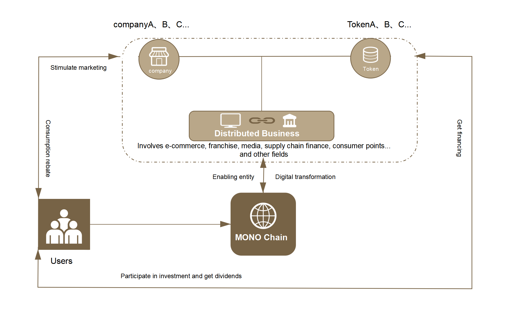

# Introduction of Monolith

Applied Public Chain for Helping Companies Achieve the Digital Economy

## PART ONE, About MONO

The name of Monolith (Referred to as "MONO") is derived from a Black Stone in the<2001: A Space Odyssey>，which is the one of the most well-known science fiction writer, Arthur C. Clarke , of the 20th century.MONO takes the name of Monolith, the original stone of wisdom, meaning that it uses its supreme energy as a medium to give all things aura.

At present, with people's awareness of the importance of digital assets, the complexity of the blockchain world leads to more and more attention to the different scenarios and the difficulty of the intersection of the blockchain.The MONO exists as a bridge to link different digital assets to provide services for the real economy to achieve digital transformation.Through decentralization and self-organization system constructing, the physical scenes are given an impetus for orderly development, so as to realize the free flow of value between individuals and create a true decentralized blockchain network.

## PART TWO, Services for Assets Digitalization

| Asset Class | Definition | Service Object |
| :-----: | :----: | :----: |
| **Digital Traditional Financial Assets** | Digitize traditional financial assets through blockchain technology, and achieve on-chain storage, circulation, transaction, and settlement. | Assets formed by accounts receivable, notes receivable, loans, other receivables, equity investments, debt investments, and derivative financial instruments |
| **Digital Alternative Financial Assets** | Digitize non-standard financial assets other than traditional financial assets, and achieve on-chain storage, circulation, transaction, and settlement. | Physical assets, supply chain financial assets, non-performing assets, entrusted bonds, etc. | 
| **Mainstream Digital Assets** | Digital assets with broad visibility and consensus basis, and based on node networks and digital encryption algorithms. | BTC、ETH,etc. |
| **Innovative Digital Assets** | Consensus is formed in the business process, and it is anchored with real value and realizes the digital assets of storage, circulation, transaction and settlement on the chain. | Consensus digital assets |

## **PART THREE，Strategic Trilogy of Technology**

### **Step 1,Technical realization of Enhanced Tokens**

Highly modular design, natively token components provides for homogenous and non-homogeneous, enabling scene parties to select components as needed to quickly develop business.

### **Step 2,Tokens circulation platform constructing**

Built a decentralized exchange natively, so that various tokens can be quickly exchanged and promote price discovery.

### **Step 3,Regulated digital asset circulation ecology**

Develop native components that can be governed and regulated on the chain, and at the same time introduce smart contracts, the customization capabilities provided can help native components shield national/regional regulations or standards differences.

## PART FOUR, Business Highlights

First, improve the bottom layer of the blockchain and deploy a Decentralized blockchain network with Structural mutual recognition, Secure sharing, interface interconnection and scenario mutual access.

Secondly, it is committed to developing practical application scenarios and empowering the real economy with blockchain. On the basis of the bottom of the blockchain, realize the decentralization of MONO main chain data storage, ecological self-management, power-response self-incentive, and collaborative self-driving, so as to empower the development of real application scenarios of the real economy.

Finally, embracing financial regulation and the key to digital transformation of physical assets is to integrate legal digital currencies of different countries and adapt to different national/regional standards according to local conditions. Only by doing this can digital assets be truly freely transferred.

## PART FIVE,Token Distribution of MONO

Monolith's native token is Mono,it can be used to pay GAS fees for transactions, staking, on-chain governance processes, etc.The total amount of Mono is 1.8 billion. The mainnet will be issued once and all will be locked.

- Monolith Foundation

    (project incubation, ecological investment, node participant rewards, etc.)     45%

- Community Building   30%

- Developer Community   10%

- Founding team    20%

## PART SIX,Application Scenario

Currently MONO's distributed business involves e-commerce, supply chain finance, media, consumer points, franchise chains and other fields. By providing digital token transformation services, it helps the real industry achieve marketing, data security management and financing purposes.

Take e-commerce as an example,in the traditional e-commerce platform, the relationship of the roles in each link is: platform>merchant>consumer.The platform is the biggest beneficiary of the entire e-commerce relationship.As for merchants, they are parasitic under the platform. In addition to paying huge amounts of “protection fees” on a regular basis, they are also facing increasing pressure from peer competition and the risk of non-stop loss of private traffic.Consumers are the biggest "lamb" in the entire e-commerce industry. No matter how much they contribute to the platform, any benefits other than commodities have nothing to do with consumers.

Distributed e-commerce changed this situation.The MONO network has designed a model of the mining output platform for the distributed e-commerce platform.The number of merchants participating in mining and the rewards received from mining are closely related to their performance and their share of the total platform performance,that means the better the platform performance, the more positive the feedback value of the merchant's token.At the same time, in addition to holding platform tokens in a consumer way, users can also participate in platform staking directly to obtain dividends at a low threshold.This new business model that uses the token as a medium to stimulate the closed-loop and positive circulation of the platform's business has a greater flexibility and changes the relationship between traditional e-commerce platforms, merchants and consumers.These three have a certain degree of autonomy to maximize the value of all parties.

## Figure

  

Three advantages of MONO distributed business.

**Ecological self-management**: From the basic layer, it includes the deployment of modules such as supply chain services, token systems, account systems, and data storage to improve infrastructure construction and achieve ecological self-management;

**Power-response self-incentive**: On the service level, set up perfect systems such as wallets, credit ratings, incentives and equity, and use smart contracts to automatically regulate and encourage the execution of all parties' contributions in order to achieve self-incentives for rights and responsibilities;

**Collaborative self-driving**:In terms of application layer, for the improvement of systems such as collaborative office, dividends, and transaction consumption, digital efficiency is improved, and collaborative self-driven.